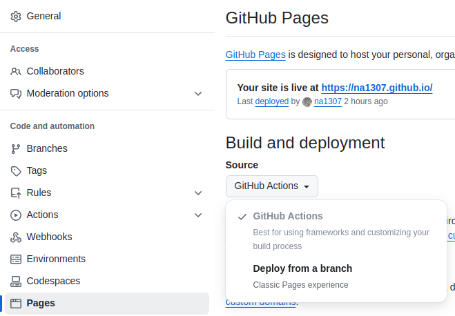

# GitHub Pages Blazor WASM

This action allows you to deploy your Blazor WASM app to GitHub Pages.

## Table of Contents
- [GitHub Pages Blazor WASM](#github-pages-blazor-wasm)
  - [Table of Contents](#table-of-contents)
  - [What this does](#what-this-does)
  - [How to use](#how-to-use)
    - [1. Set the Project](#1-set-the-project)
    - [2. Set the repository settings](#2-set-the-repository-settings)
    - [3. Add workflow file](#3-add-workflow-file)
  - [Inputs and Outputs](#inputs-and-outputs)
    - [Inputs](#inputs)
    - [Outputs](#outputs)
  - [Troubleshooting](#troubleshooting)
    - [Common Issues](#common-issues)

## What this does

Restore, build, and publish the project, modify index.html and 404.html to fit the repository.

## How to use

### 1. Set the Project

Add [`Bluehill.Blazor.GHPages` NuGet Package](https://www.nuget.org/packages/Bluehill.Blazor.GHPages/) to the project.
This Package adds `gh-pages.js` and `404.html` to the published `wwwroot` directory. If these files already exist,
delete them.

Modify `index.html` to include the `gh-pages.js` script. This script adjusts routing for Blazor WebAssembly apps
deployed to GitHub Pages, ensuring the app behaves correctly when navigating subpages.

```html
<script src="gh-pages.js"></script>
<script src="_framework/blazor.webassembly.js"></script>
```

### 2. Set the repository settings

Go to your repository's **Settings > Pages > Source** and set the source to **GitHub Actions**.

This step is crucial for enabling deployments using the GitHub Pages workflow. For reference:



### 3. Add workflow file

Below is an example workflow that deploys your Blazor WebAssembly app to GitHub Pages. Copy these into
`.github/workflows/gh-pages.yml` in your repository.

> **Replace `MyBlazorApp/MyBlazorApp.csproj` with your actual `.csproj` path.**

```yml
name: Deploy GitHub Pages

on:
  # Runs on pushes targeting the default branch
  push:
    branches: [ "main" ]

  # Allows you to run this workflow manually from the Actions tab
  workflow_dispatch:

# Sets permissions of the GITHUB_TOKEN to allow deployment to GitHub Pages
permissions:
  contents: read
  pages: write
  id-token: write

# Allow only one concurrent deployment, skipping runs queued between the run in-progress and latest queued.
# However, do NOT cancel in-progress runs as we want to allow these production deployments to complete.
concurrency:
  group: "pages"
  cancel-in-progress: false

jobs:
  # Build job
  build:
    runs-on: ubuntu-latest
    steps:
      - name: Checkout
        uses: actions/checkout@v5
      - name: Setup .NET
        uses: actions/setup-dotnet@v5
        with:
          dotnet-version: 9.0.x
      - name: Prepare Blazor WASM for GitHub Pages
        uses: na1307/blazor-github-pages@v5
        id: prepare
        with:
          project-path: MyBlazorApp/MyBlazorApp.csproj
      - name: Setup Pages
        uses: actions/configure-pages@v5
      - name: Upload artifact
        uses: actions/upload-pages-artifact@v4
        with:
          path: ${{ steps.prepare.outputs.wwwroot-path }}

  # Deployment job
  deploy:
    environment:
      name: github-pages
      url: ${{ steps.deployment.outputs.page_url }}
    runs-on: ubuntu-latest
    needs: build
    steps:
      - name: Deploy to GitHub Pages
        id: deployment
        uses: actions/deploy-pages@v4
```

## Inputs and Outputs

This action has three inputs and one output.

### Inputs

`project-path`: Path of project (.csproj). Required, no default value. For example: `MyBlazorApp/MyBlazorApp.csproj`.

`publish-path`: Path to output in the Publish step. Most of the time, you can leave this as the default `_out`. However,
you can specify a custom path if needed for your project structure or workflow requirements.

`gh-token`: The Github Token. Used to determine whether the domain of the repository pages is a GitHub hosted domain or
a custom domain.

> **Note:** Inputs `main-repo` and `fix-404` have been **deprecated** as of version v3 and **removed** as of version v4.
> This action now:
> - Automatically detects if the repository is the default Pages repository (username.github.io).
> - Modifies `404.html` if it exists.

### Outputs

`wwwroot-path`: The resulting `wwwroot` path. It must be passed to `path` in the `upload-pages-artifact` action.

## Troubleshooting

### Common Issues

1. **`wwwroot` Path Not Found**
    - Ensure the Blazor project builds and publishes successfully.
    - Verify that the `publish-path` input matches the expected output directory.

2. **Deployment Fails**
    - Ensure that your repository’s Pages Source is set to **GitHub Actions**.
    - Check the logs in the **Deploy to GitHub Pages** step for detailed error messages.

3. **Routing Issues**
    - Confirm that `gh-pages.js` is included in `index.html` as shown in [Step 1](#1-set-the-project).

For additional support, file an issue in the [GitHub repository](https://github.com/na1307/blazor-github-pages).
